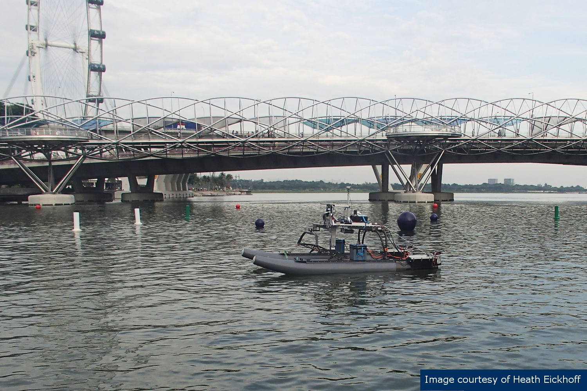
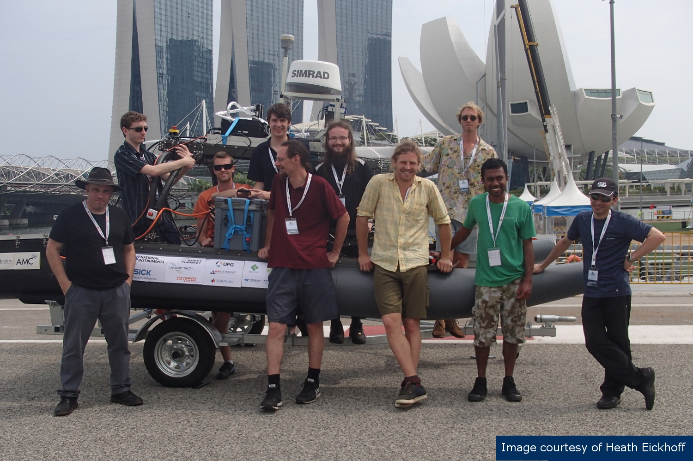

## Maritime RobotX 2014

### Marina Bay, Singapore

### 20-26 October 2014

In 2014, the Martime RobotX Challenge was hosted in Marina Bay, Singapore. Located in the southern shores of Singapore, this area provided a prominent but sheltered area where public could view the whole event.

### Competition Challenges

The competition comprised of a diverse variety of tasks which had to be completed autonomously. Some individual tasks included: obstacle navigation, docking and underwater beacon localisation. The autonomous surface vessel would enter a competition course and perform all the tasks it could. Points were awarded based on time to complete, accuracy and tasks completed.

### TopCat at Singapore

In 2014 ToCcat was taken to Singapore with a team of honours students and staff from Flinders University and the Australian Maritime College. The team had developed software and hardware to solve most of the challenges however prior to the competition TopCat had very few on water hours. This was the biggest challenge for the team at Singapore as complete systems integration and debugging had to be performed onsite.

### Lessons Learnt

Attending the competition was a great experience. It was exciting, fun, challenging and sometimes stressful but the team enjoyed it all.

While at the competition many challenges arose and were solved in the field. Some of the key lessons learned from this experience include:

- field testing is key: while our system design was excellent, not completing lots of on water testing let us down.
- heat and humidity are challenging: the team had difficulty with moisture on camera lenses and overheated computers.
- check your math and check it again: the team had to reposition the batteries during the competition due to a miscalculation in design
