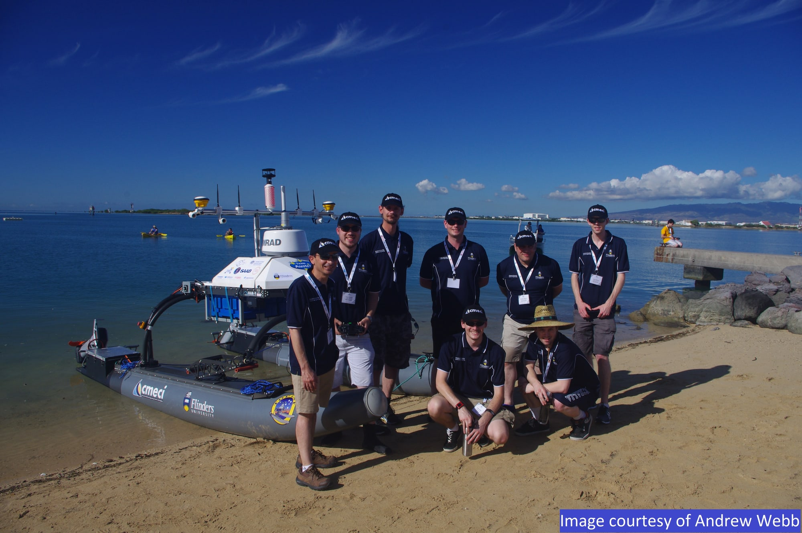

## Sand Island – O’ahu, Hawaii

### 09-20 December 2016

The 2016 Maritime RobotX Challenge was hosted at Sand Island on O’ahu, Hawaii. Team Australis2 was proud to once again represent Flinders University and South Australia.

### Competition Challenges

This years competition consisted of eight tasks. These tasks included:

- Navigation and Control
- Identify Symbols and Docking
- Detect and Deliver
- Finding Totems and avoiding obstacles
- Scanning Code on Totem
- Underwater shape identification
- Find the break
- Acoustic Pinger-based Transit

### Lessons Learnt

what did we learn from this comp

- testing hardware/software
- KISS – scope of the project
- programming nuts and bolts

overall we did things and stuff
