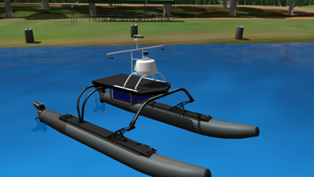

## Virtual RobotX Challenge

### 12th April 2022

The 2022 VRX competition was hosted online. Team Australis2 are proud to once again represent Flinders University and South Australia.

The 2022 team is almost completely comprised of undergraduates who are new to field robotics. As such, the 2022 Virtual RobotX was an opportunity for the team to learn about the techniques required for development of field robots and the fundamentals of software development with the Robotics Operating System.

The software codebase of previous years was examined and overhauled, and new approaches were examined for mission planning. Overall the result was succesful, with the team doing particularly well in the Gymkhana task.

### Competition Challenges

This years competition consisted of eight tasks. These tasks included:

- Station Keeping
- Way finding
- Landmark Localization and Characterization
- Wildlife Encounter and Avoid
- Channel Navigation, Acoustic Beacon Localization and Obstacle Avoidance
- Scan and Dock and Deliver

### Lessons Learnt

- Setting realistic timelines. When starting the project we underestimated the challenges that occured and the time it would take to complete a challenge.
- Breaking tasks into smaller tasks. Rather than trying to complete tasks with one huge program we ended up breaking tasks into smaller subtasks that could be completed easier.
