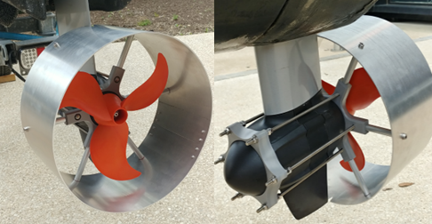
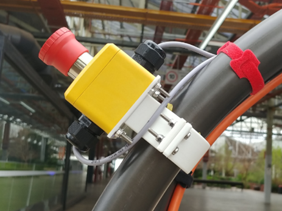

## Propellor Shrouds

The RobotX 2022 competition required the addition of propeller shrouds on the vessel as a safety feature. Its main use is in the prevention of injury from active propeller blades for personnel around the boat. Due to the age of the Torqeedo motors currently installed on the boat, it was difficult to source propeller shrouds as Torqeedo updated their motor design since the existing motors were acquired. Therefore, it was decided that the shrouds would be designed and manufactured in-house at Flinders University.

The overall design of the shroud is an adaptation of the current line-up of propeller guards offered by [Torqeedo](https://thetorqeedoshop.com.au/product/propeller-guard/). An absence of accurate Computer Assisted Drawing (CAD) models of the motors meant measurements of the motors needed to be taken. This was done through scanning the motor and 3D printing prototypes to ensure the shroud accurately fitted the motor.

After analysing some options, the final design comprised of a separate rolled aluminium tube that would be screwed onto an internal PVC bracket. The shroud was manufactured with water and corrosion resistance in mind therefore the fasteners were all 316 stainless steel or aluminium, this can be seen below.

## Emergency Stop System

Four mechanical e-stops are required on TopCat for it to pass the safety regulations of the competition. Due to the age of the previous e-stops, it was decided that they would be replaced and four new IP67 [estops](https://au.rs-online.com/web/p/emergency-stop-push-buttons/8264397) would be installed onto the vessel. The old e-stop mount had the issue of fasteners that were difficult to access, and thus the decision was made to redesign the old mounting system. The new design focused on making the nuts and bolts more accessible and included a new face plate, made of acetal, used to make the new estops more readily changeable in the future. This was done by mounting the e-stop onto the plate instead of the directly onto the bracket. An emphasis on corrosion resistant fasteners was also made in this area, therefore the fastener material was G316 stainless steel.

The new e-stops are IDEM e-stops designed for surface mount and rated for IP67. M20 cable glands were used on the e-stops to better seal and protect the connections from the environment. The new front e-stops are connected in series, with the aft e-stops to the electrical box. All new e-stops have been installed and were confirmed to be in a functional state.

Estop were mounted using maritime grade G316 stainless steel bolts, to protect against degradation due to weather, and held together with nyloc nuts to protect the connection against vibrations.

