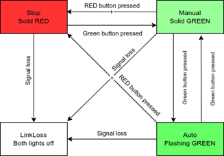
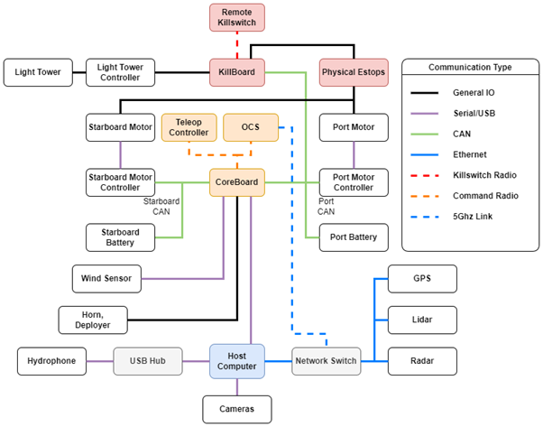

## System Communication

The TopCat USV has multiple communication systems used to connect between system actuators, radio communications and ROS topics. At the core of this system was the Core Board, a microcontroller system that connected RF teleop, CAN messages and ROS communications. Together these boards had the following functions:

- Communicate with the teleoperation system using MAVLINK messages over the 900MHz radio link
- Communicate with the Kokam batteries using CAN
- Communicate with the Actuators using CAN
- Communicate with the higher level autonomy package using ROS topics
- Control low-level functions including deployer operation and battery switching

Information logged to the autonomy system includes battery voltage and temperature, max and min cell voltages, battery currents, motor speed, temperature, and current draw. The autonomy system can control battery state, motor actuation, and deployer raise and lowering using ROS topics.

A second board with a modified firmware called the *kill board* was tasked with:

- Control of motor isolation relays
- Control of the vehicle status light

* The core and kill boards implemented a state machine, moving between *linkloss*, *stop*, *manual* and, *auto* modes under the control of their respective remotes shown below.

*image courtesy of Jonathan Wheare*

TopCat uses three communication buses, Ethernet, Universal Serial Bus (USB), and Controller Area Network (CAN) bus. Communication with the battery and engine modules is across CAN while sensors are connected via a combination of Ethernet and USB. USB devices are directly connected to the host computer through a USB hub. An onboard Ethernet switch maintains network communications on the boat, with a direct line of communication to the shore via a 5Ghz long range antenna. While CAN data, both a port side and starboard bus, is interpreted via the core board microcontroller into USB communication with the host computer.

*image courtesy of Daniel Philbey*

Communication channels from vessel to shore were selected based on legal and operational requirements. For teleoperation and remote kill switch communications, two 900MHz radio modem nets were selected. Australia and the USA both permit use within the 900MHz Industrial Scientific Medical (ISM) band, though Australia’s ISM frequency allocation is smaller than that of the USA. Therefore, the radio modems are compliant with both USA and Australian regulations. These radios were tested with a spectrum analyser and found to be within the expected frequency range.

For data transfer and high bandwidth communications a point-to-point 5GhZ Wi-Fi link was used. This system uses two Ubiquiti Rocket M5 modems with an Omni-directional antenna on TopCat, and a directed antenna for the Operator Control Station. The system can be configured for use around the world and is set up to meet both USA and Australian standards.
