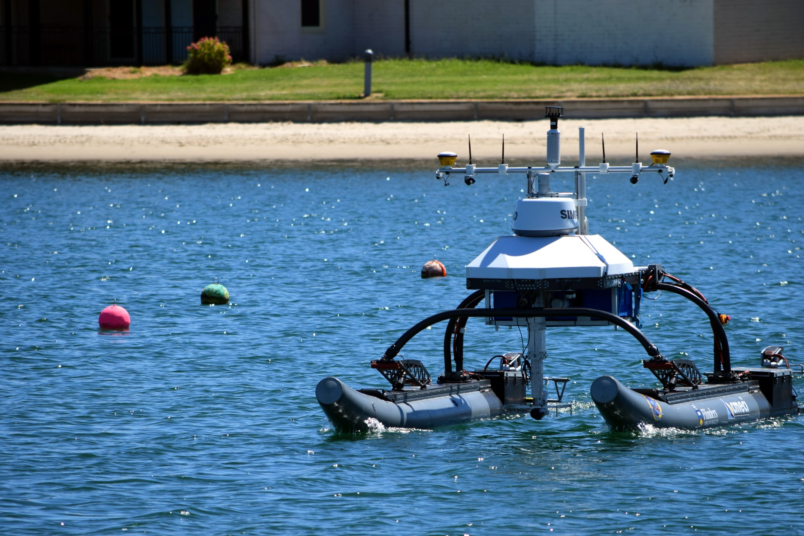

## Topcat

TopCat is an electrically powered autonomous surface vessel that carries a range of advanced sensing equipment. The vessel uses the suspension system on the [WAM-V](http://www.wam-v.com/) platform to provide a stable base for the sensor suite and power systems. 
Five metres long with a top speed of 11 knots (20 km/h), a cruising speed of around 4 knots (8 km/h) and a cruise endurance close to 12 hours, TopCat is well suited to monitoring tasks in hostile conditions or protected areas. The vessel is currently capable of mapping and monitoring tasks using the onboard Lidar and Radar systems. Additional sensors such as sonars can be attached to the underwater deployer to perform specific tasks such as sea bed mapping or environmental surveying.

## User Interface

A key part of developing unmanned vehicles is ensuring an easy to use and reliable user interface. Developing a system which both provides sufficient information for systems analysis while allowing non technical researchers to easily view data has been our main focus.

Our user interface consists of a base control station which relays system information and safety data to the mission supervisor, as well as a web based data interface which allows users to access and visualise only the data relevant to them.

## Software

The software which runs TopCat is based on the Robot Operating System (ROS). ROS is a collection of open source software libraries and tools which enable rapid development of robot software infrastructure. On top of this backbone we have developed multiple algorithms including object recognition and classification, mission planning, navigation and control systems. These systems allow TopCat to autonomously plan and execute given tasks such as mapping a selected area.

---

## Hardware and Sensors

TopCat’s hardware is a combination of off the shelf parts and custom built systems. The focus for the overall hardware design was stability, reliability and modularity to allow safe, easy operation and upgrades. The vessel is a stable inflatable catamaran (WAM-V ’16) platform powered by two independently steered Torqeedo Cruise 2R electric motors and 2 x 3.88 kWh Li-Ion batteries. This hardware setup provides a reliable and easy to use platform to develop and test our software algorithms. TopCat carries a broad selection of on board sensors for navigation, control, obstacle avoidance, and mapping above and below the water. Additionally, mission specific sensors can be easily integrated as required.
